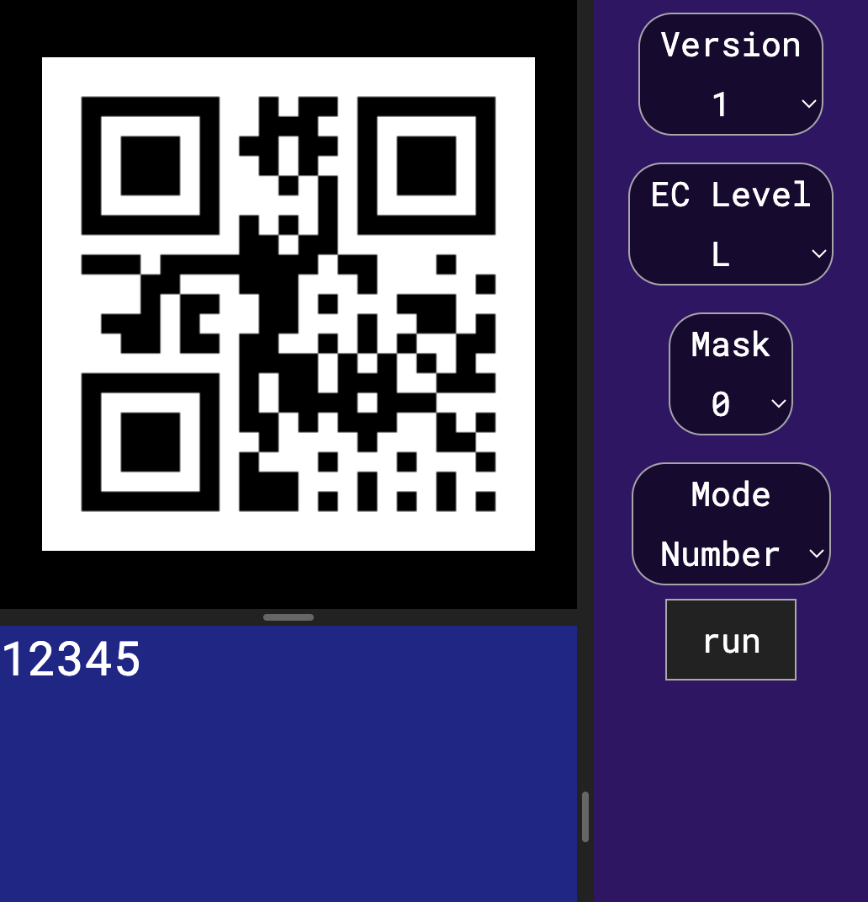

# QR_Code

Here is the [link](https://kteruuchi.github.io/QR_Code/).

<!-- ## Sample
  -->

## Command
| Command | About |
|:--------|-------|
| clear | clear all log |
| hide log | change visibility to 'hidden' |
| show log | change visibility to 'visible' |
| size  `number` | change the module size. |
| mp `int` | change Mask Pattern. Expected value is 0 to 7 |
